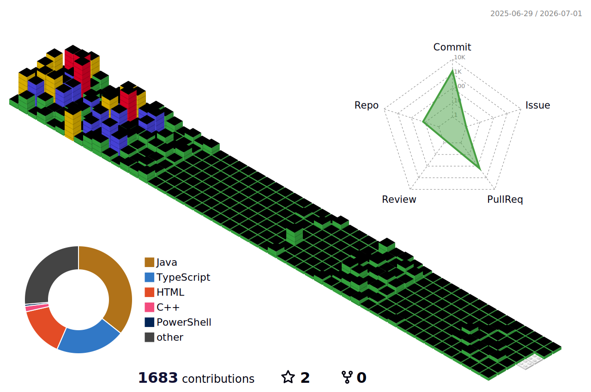

  

<h2> Who Am I?</h2>

<table>
  <tr>
    <td width="160" align="center">
      
    </td>
    <td>
      <strong>프로그래머가 아니라 개발자, 고건우입니다.</strong>  
      돌아가게 만드는 건, 이제 누구나 가능합니다. 
      그래서 코드를 짜기 전에 <strong>무엇을 어떻게 만들지 설계하는 데</strong> 더 많은 시간을 씁니다.
       
       
      
      
    </td>
  </tr>
</table>

 

<h2> Team Projects</h2>

| 리포지토리 | 기술 스택 | 담당 역할 |
|---|---|---|
| [Resonos-React](https://github.com/Lee-0210/Resonos_React) | React, Spring Boot | Thymeleaf 프로젝트의 React 전환. 담당 컨트롤러 리팩토링, 커뮤니티 게시글 · 투표 기능 구현, 비회원 게시글/댓글의 조건부 렌더링 처리 |
| [Resonos](https://github.com/ruff1376/Resonos) | Spring Boot, Thymeleaf | 아티스트 · 트랙 · 앨범 상세 페이지 담당. 핵심 상호작용을 비동기 요청으로 처리해 즉각적인 피드백 구현, YouTube API 연동 |
| [할건해야짐](https://github.com/ruff1376/AI3_MINI1_TEAM3) | Spring Boot, chart.js | 기구 관리 · 매출 관리 기능 담당, chart.js 기반 매출 시각화 |

 

<h2> Personal Projects</h2>

| 리포지토리 | 기술 스택 | 내용 |
|---|---|---|
| [Playsync](https://github.com/GUNW-O-O/playsync) | NestJS, Next.js, Redis, PostgreSQL, WebSocket | 여러 사용자가 동일한 게임 상태를 공유하는 환경에서, 서버가 상태를 일관되게 관리 · 전파하는 실시간 동기화 구조 설계 |
| [Lexi-hub FE](https://github.com/GUNW-O-O/lexi-hub) / [BE](https://github.com/GUNW-O-O/lexi-hub-backend) | TypeScript, React(FSD), NestJS, MongoDB, JWT | FSD 아키텍처 학습, NestJS 모듈화와 NoSQL 데이터 모델링, JWT 기반 인증 흐름 구현 |
| [Lexi-hub Flutter](https://github.com/GUNW-O-O/lexi-hub-flutter) | Flutter, Dart | Lexi-hub 백엔드를 활용한 크로스 플랫폼 클라이언트 |
| [AboutMe](https://github.com/GUNW-O-O/aboutMe) | TypeScript, React | 포트폴리오 SPA — 상단 about.me 배지에서 확인 가능 |

 

<h2> GitHub Stats</h2>

  

  

