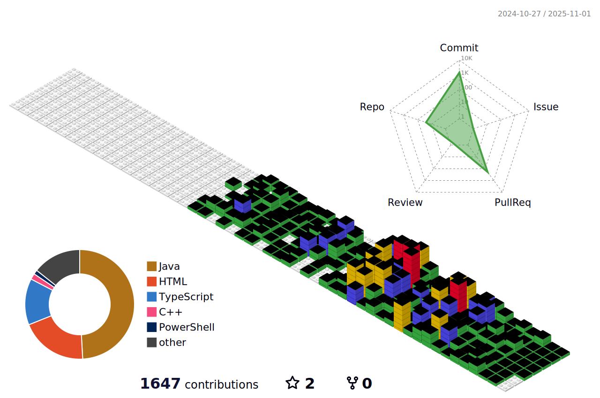

## Hi there 👋

 
<h2 style="border-bottom: 1px solid #d8dee4; color: #282d33;"> 🏅 Stats </h2>
  
 
    
  
 
  

    
  

  

    
  

<!--

    <h2 style="border-bottom: 1px solid #d8dee4; color: #282d33;"> 🛠️ Tech Stacks </h2>   
    
 
          
          
          
          
           
          
          
          
          
           
          
          

    

-->

<!--
**GUNW-O-O/GUNW-O-O** is a ✨ _special_ ✨ repository because its `README.md` (this file) appears on your GitHub profile.

Here are some ideas to get you started:

- 🔭 I’m currently working on ...
- 🌱 I’m currently learning ...
- 👯 I’m looking to collaborate on ...
- 🤔 I’m looking for help with ...
- 💬 Ask me about ...
- 📫 How to reach me: ...
- 😄 Pronouns: ...
- ⚡ Fun fact: ...
-->

